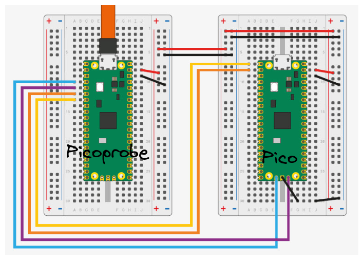

# VS Code Dev Container Environment For Raspberry Pi Pico C/C++

This project provides a ready-to-use portable development environment for Raspberry Pi Pico using C/C++ based on [Visual Studio Code Dev Containers](https://code.visualstudio.com/docs/devcontainers/containers).

The environment is based on containers (*Podman to be specific*) which provides a easy to start way to run the development tools and libraries required for C/C++ development. The containers will be configured with all necessary dependencies and tools, such as a C/C++ compiler and debugger. The editor comes configured with extensions for C/C++ development, such as language support and debugging tools.

## Udev Rules

There might be some issues when mounting devices using root-less containers, such as when using Podman. Because of that there is a requirement to pre-configure UDEV rules for `openocd`. The repository includes [60-openocd.rules](./60-openocd.rules) file which needs to be placed in `etc/udev/rules.d/` and the [Picoprobe](https://github.com/raspberrypi/picoprobe) reconnected. Please note, that these rules were updated for Fedora OS. The original file can be found in [here](https://raw.githubusercontent.com/raspberrypi/openocd/rp2040/contrib/60-openocd.rules). [devcontainer.json](./devcontainer.json) contains custom run arguments with annotations for container runtime, like `run.oci.keep_original_groups=1`. It is meant to fix group membership issues and prevent missing permission errors when trying to access devices from container. Correct annotation needs to be used according to the container runtime (oci, crun).


## Flash Binaries

```bash
# build binary manually
make build

# flash binary directly using openocd
make flash
```

## Linting

There is an option to enable C++ code linting functionality using [Clang-tidy](https://clang.llvm.org/extra/clang-tidy/). Install the linter using the commands below.

```bash
apt update && apt install clang-tidy

```

## Picoprobe Wiring




## References

- [Raspberry Pi Pico SDK](https://github.com/raspberrypi/pico-sdk)
- [Raspberry Pi Pico and RP2040 - C/C++ Part 1: Blink and VS Code](https://www.digikey.lt/en/maker/projects/raspberry-pi-pico-and-rp2040-cc-part-1-blink-and-vs-code/7102fb8bca95452e9df6150f39ae8422)
- [Raspberry Pi Pico and RP2040 - C/C++ Part 2: Debugging with VS Code](https://www.digikey.be/en/maker/projects/raspberry-pi-pico-and-rp2040-cc-part-2-debugging-with-vs-code/470abc7efb07432b82c95f6f67f184c0)
- [Raspberry Pi Pico and Pico W](https://www.raspberrypi.com/documentation/microcontrollers/raspberry-pi-pico.html)
- [RP2040 Datasheet](https://datasheets.raspberrypi.com/rp2040/rp2040-datasheet.pdf)
- [Raspberry Pi Pico SDK](https://github.com/raspberrypi/pico-sdk)
- [Picoprobe](https://github.com/raspberrypi/picoprobe)
- [Getting started with Raspberry Pi Pico](https://datasheets.raspberrypi.com/pico/getting-started-with-pico.pdf)
- [Picoprobe: Using the Raspberry Pi Pico as Debug Probe](https://mcuoneclipse.com/2022/09/17/picoprobe-using-the-raspberry-pi-pico-as-debug-probe/)

