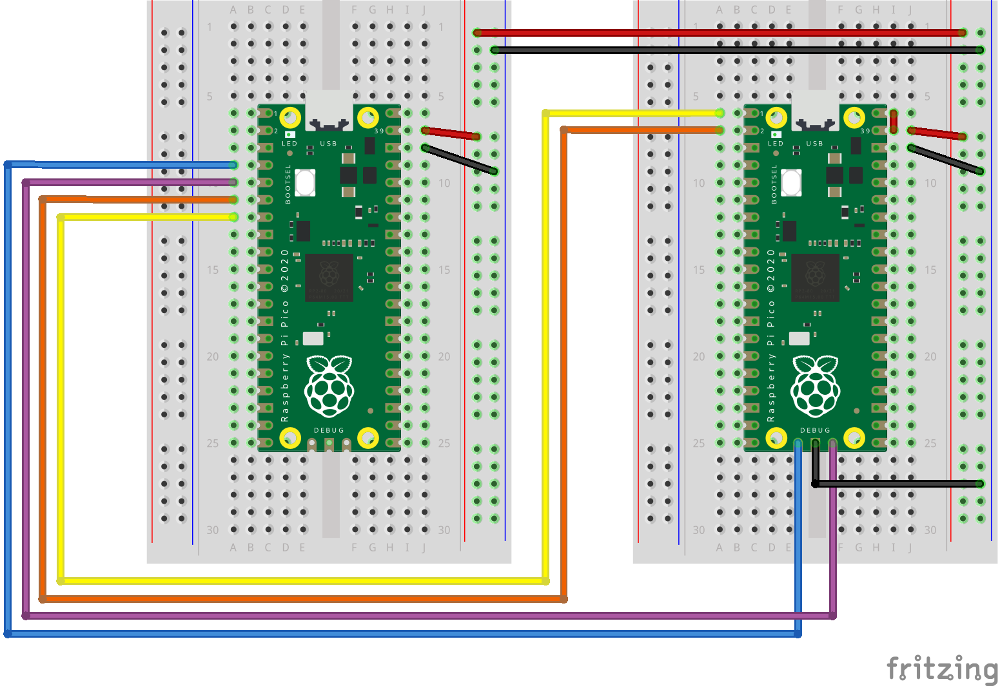

# Connecting USB HID Devices to Raspberry Pi Pico

The module works on USB Host functionality natively supported by Pico. The end goal is to register certain joystick button presses and perform some actions.


## Flash Binaries

```bash
# build binary manually
make build

# flash binary directly using openocd
make flash

# reset Pico
make reset
```


## Debugging

```bash
minicom -b 115200 -8 -D /dev/ttyACM0
```

## Wiring Diagram

The Pico on the left is used for flashing Pico on the right. Keyboard or joystick should be attached to the Pico on the right with [USB OTG](https://en.wikipedia.org/wiki/USB_On-The-Go) cable.




## References

- [Raspberry Pi Pico SDK](https://github.com/raspberrypi/pico-sdk)
- [Raspberry Pi Pico and Pico W](https://www.raspberrypi.com/documentation/microcontrollers/raspberry-pi-pico.html)
- [RP2040 Datasheet](https://datasheets.raspberrypi.com/rp2040/rp2040-datasheet.pdf)

- [raspberry pi pico - usb host](https://www.youtube.com/watch?v=yIXa-6DRW-Y)
- [pico example: host_cdc_msc_hid](https://github.com/raspberrypi/pico-examples/tree/master/usb/host/host_cdc_msc_hid)
- [Raspberry-shifter software](https://github.com/brendena/raspberry-shifter)
- [Would you like to reset your Pico from the command line?](https://forums.raspberrypi.com/viewtopic.php?t=303028)